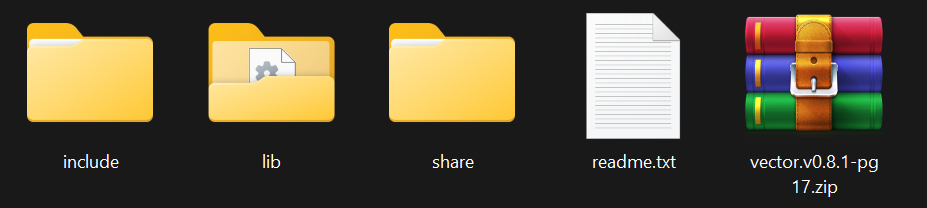
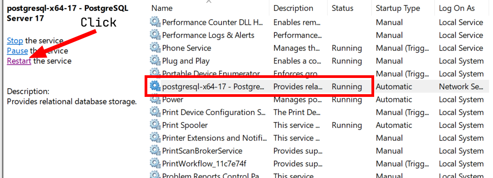
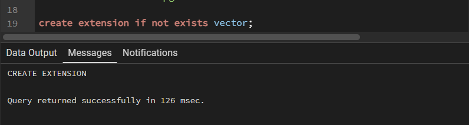
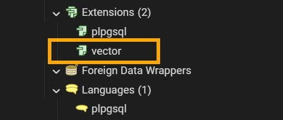

# Cấu hình Tiện ích Mở rộng: pgvector

Tài liệu này hướng dẫn chi tiết quy trình cài đặt thủ công thư viện `pgvector` cho PostgreSQL 17 trên hệ điều hành Windows mà không cần sử dụng phần mềm bên thứ ba như Docker, v.v.


## 1. Yêu cầu hệ thống
- **Phiên bản PostgreSQL**: 17.x (x64)
- **Hệ điều hành**: Windows 10/11
- **Quyền truy cập**: Quản trị viên (cần thiết để thao tác hệ thống tập tin)

## 2. Nguồn tài liệu
- **Nguồn**: [pgvector_pgsql_windows](https://github.com/andreiramani/pgvector_pgsql_windows)
- **Thành phần**: Bộ tệp nhị phân đã được biên dịch sẵn (bao gồm include, lib, share)



## 3. Các bước cài đặt
### Bước 1: Phân bổ tệp tin
Giải nén bộ tệp đã tải và sao chép nội dung vào thư mục cài đặt PostgreSQL (Mặc định: `C:\Program Files\PostgreSQL\17`):

| Thư mục Nguồn | Đường dẫn Đích | Tệp Mục tiêu |
| :--- | :--- | :--- |
| `lib/` | `...\17\lib` | `vector.dll` |
| `share/extension/` | `...\17\share\extension` | `vector.control`, `vector--*.sql` |
| `include/` | `...\17\include\server\extension\vector` | `vector.h`, v.v. |

Nếu trong thư mục .Program Files\PostgreSQL\17\include\server\extension có những thư mục con khác, hãy tạo thư mục `vector` mới và sao chép các tệp từ `include/` vào đó để trình biên dịch tìm thấy đúng file và tránh xung đột hoặc lẫn lộn với các header chung hệ thống.

### Bước 2: Khởi động lại Dịch vụ
Để PostgreSQL nhận diện thư viện mới, cần khởi động lại dịch vụ:
1. Nhấn `Win + R`, gõ `services.msc`, và nhấn Enter để mở **Services**.
2. Tìm dịch vụ có tên **postgresql-x64-17**.
3. Nhấp chuột phải và chọn **Restart** hoặc nhấn **Restart** ở bảng bên trái.



### Bước 3: Kích hoạt trên Cơ sở Dữ liệu
Mở lại PgAdmin và thực thi lệnh SQL sau trên cơ sở dữ liệu của bạn (ví dụ: qua pgAdmin hoặc psql):

```sql
CREATE EXTENSION IF NOT EXISTS vector;
```



## 4. Xác minh
Chạy truy vấn sau để xác nhận việc cài đặt:
```sql
SELECT extversion FROM pg_extension WHERE extname = 'vector';
```
Kết quả mong đợi: phiên bản bạn đã cài đặt.
