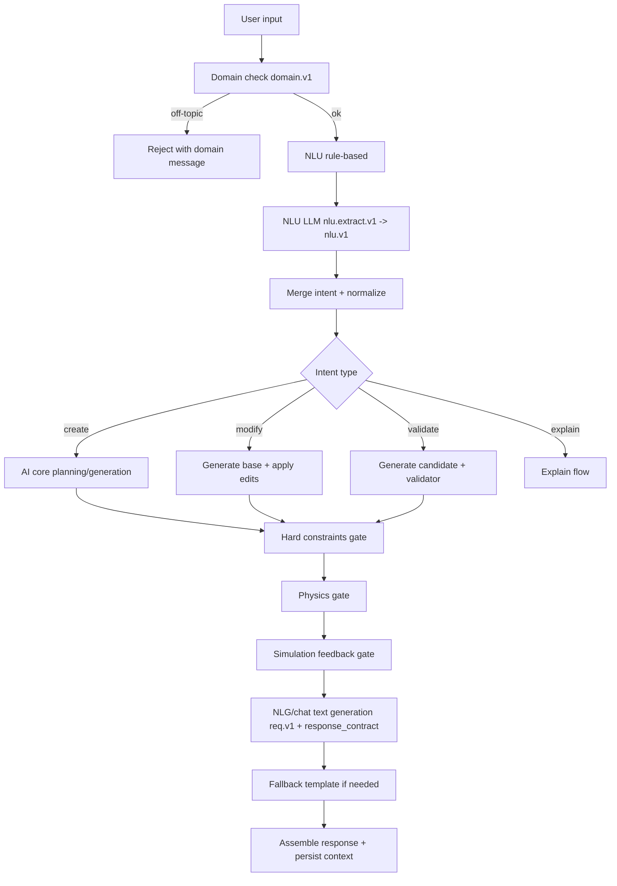

# Bao cao cap nhat xu ly prompt va nguyen ly xu ly input dau vao

Ngay cap nhat: 2026-04-19

## 1) Muc tieu va pham vi

Tai lieu nay tong hop:
- Ket qua re-run full domain suite de so voi baseline loi ngoai pham vi.
- Qua trinh cap nhat xu ly prompt theo huong backend-first.
- Nguyen ly hoat dong cua he thong xu ly input dau vao (tu user request den response).

Pham vi ky thuat lien quan:
- Chuan hoa LLM contract compact req.v1.
- Prompt governance va inventory metadata.
- Prompt minimization (giam do dai system prompt) + dua rang buoc sang payload contract.
- Pipeline NLU -> planning -> validate -> NLG trong chatbot flow.

## 2) So sanh ket qua test full domain suite

### 2.1 Baseline truoc do (ngoai pham vi)

- Baseline da ghi nhan truoc do: **127 passed, 13 failed, 63 warnings**.
- Nhom loi tap trung: export oracle + template builder + topology planner gain policy.

### 2.2 Ket qua re-run hien tai

Lenh da chay:

```powershell
Set-Location d:/Work/thesis/electronic-chatbot/apps/api
d:/Work/.venv/Scripts/python.exe -m pytest tests/domain -q
```

Ket qua:
- **128 passed, 12 failed, 63 warnings**
- Thoi gian: ~18.50s

Delta so voi baseline:
- Passed: **+1**
- Failed: **-1**
- Warnings: **khong doi**

### 2.3 Danh sach fail hien tai (12)

1. tests/domain/test_export_oracle_validation.py::test_pcb_export_soft_oracle_failure_keeps_artifact
2. tests/domain/test_template_builder.py::test_bjt_ce_basic
3. tests/domain/test_template_builder.py::test_bjt_ce_with_override
4. tests/domain/test_template_builder.py::test_bjt_ce_no_coupling
5. tests/domain/test_template_builder.py::test_bjt_cc_basic
6. tests/domain/test_template_builder.py::test_bjt_cb_basic
7. tests/domain/test_template_builder.py::test_opamp_inverting
8. tests/domain/test_template_builder.py::test_opamp_non_inverting
9. tests/domain/test_template_builder.py::test_opamp_differential
10. tests/domain/test_template_builder.py::test_validation_errors
11. tests/domain/test_template_builder.py::test_component_auto_generation
12. tests/domain/test_topology_planner_gain.py::test_topology_planner_gain_over_100_opamp

### 2.4 Nhan dinh theo nhom loi

- Export oracle (1 fail):
  - Stub test chua theo kip signature moi cua exporter (`options=`).
- Template builder (10 fail):
  - Ky vong test va output builder dang lech nhau (ten circuit, so component, kieu gia tri, thong diep exception).
- Topology planner (1 fail):
  - Policy gain cao cho op-amp dang khac ky vong test (`inverting` chua bi ep sang `multi_stage`).

Ket luan:
- Cac fail con lai van nam trong nhom loi ngoai pham vi migration prompt/contract.
- Tinh hinh da co cai thien nhe so voi baseline (giam 1 fail).

## 3) Ket qua governance prompt

Lenh da chay:

```powershell
Set-Location d:/Work/thesis/electronic-chatbot/apps/api
d:/Work/.venv/Scripts/python.exe scripts/prompt_governance_check.py
```

Ket qua:
- **Prompt governance check passed**

Y nghia:
- Inventory prompt co day du entry bat buoc.
- Do dai prompt khong vuot nguong metadata.
- Marker schema bat buoc duoc duy tri voi cac prompt co schema output JSON.

## 4) Tom tat qua trinh cap nhat xu ly prompt

## 4.1 Muc tieu cap nhat

- Giam phu thuoc vao prompt dai va mang logic deterministic.
- Chuan hoa contract input/output cho LLM de backend kiem soat hanh vi.
- Tang do on dinh va kha nang governance trong CI.

## 4.2 Cac huong cap nhat chinh

1. Compact payload contract (`req.v1`)
- Tat ca callsite LLM chinh su dung envelope compact:
  - `sv`: version
  - `tk`: task id
  - `in`: input object
  - `of`: output format

2. Strict response schema + retry
- LLM JSON output duoc validate bang schema typed (`nlu.v1`, `cmp.v1`, `domain.v1`).
- Co retry theo schema de giam ty le output khong hop le.

3. Prompt minimization (backend-first)
- Rut gon system prompt trong NLG/Chatbot helper.
- Chuyen cac rang buoc trinh bay/section/format sang `in.response_contract`.
- Giam token prompt, giu deterministic behavior o backend.

4. Prompt governance
- Duy tri inventory tai `docs/prompts_inventory.md`.
- Script governance parse source prompt + inventory de enforce policy.
- CI workflow co buoc governance check truoc test matrix.

## 4.3 Vi du mau contract sau cap nhat

```json
{
  "sv": "req.v1",
  "tk": "nlg.s.v1",
  "in": {
    "circuit_type": "common_emitter",
    "response_contract": {
      "language": "vi",
      "format": "markdown",
      "sections": [
        "He phuong trinh he so khuech dai",
        "Chuc nang mach",
        "Giai phap",
        "Buoc tinh toan thiet ke",
        "Thong so ky thuat cuoi cung",
        "Ket qua kiem tra"
      ]
    }
  },
  "of": "md"
}
```

Y nghia:
- Prompt system giu nguyen tac toi thieu.
- Contract o payload truyen rang buoc cau truc output de backend quan ly ro rang.

## 5) Nguyen ly hoat dong he thong xu ly input dau vao

Muc tieu phan nay la mo ta theo luong runtime thuc te cua chatbot design pipeline.

## 5.1 Tong quan luong

1. Nhap request
- User gui noi dung chat (create/modify/validate/explain).

2. Domain gate (tuy chon)
- Kiem tra off-topic qua LLM JSON schema `domain.v1`.
- Neu off-topic -> tra thong diep tu choi dung domain.

3. NLU parsing
- Rule-based parse (nhanh, deterministic).
- LLM parse (`nlu.extract.v1`) tra ve `nlu.v1`.
- Merge ket qua theo confidence + schema-validity.

4. Chuan hoa intent
- Chuan hoa `intent_type`, topology, gain/vcc/frequency, edit operations, constraints.

5. Route theo intent
- `create`: planning -> parameter solve -> validate -> simulation feedback.
- `modify`: tao base circuit -> apply edit op -> validate/retry/autofix.
- `validate`: build/generate candidate -> run validator + gate.
- `explain`: tao giai thich theo intent/context.

6. Multi-gate reliability
- Hard-constraint gate.
- Physics gate (DC/topology cross-check).
- Simulation feedback gate.
- Retry/feedback memory neu that bai.

7. NLG generation
- Goi LLM text task (`nlg.*` / `chat.*`) voi `req.v1` + `response_contract`.
- Neu LLM fail -> fallback template deterministic.

8. Response assembly + persistence
- Build payload response (message, validation, analysis, suggestions).
- Persist context/snapshot/circuit metadata theo flow.

## 5.2 So do logic rut gon



## 5.3 Nguyen tac thiet ke duoc ap dung

- Contract-first:
  - Input/Output LLM co version + schema ro rang.
- Backend-deterministic:
  - Prompt khong mang business logic dai; backend nam quyet dinh.
- Fail-safe:
  - Fallback template khi LLM unavailable/invalid.
- Observability:
  - Co governance script + test matrix cho regression tracking.

## 6) Danh muc thay doi can theo doi tiep

## 6.1 Trong pham vi prompt/contract (da on)

- Governance: pass.
- Focused contract tests: pass (da xac nhan trong cac lan chay gan day).
- CI-critical topology tests: pass.

## 6.2 Ngoai pham vi (con fail trong full domain suite)

1. Export oracle stub compatibility
- Can cap nhat stub theo signature exporter moi (`options`).

2. Template builder expectation drift
- Can dong bo test expectation voi output builder hien tai:
  - ten circuit,
  - so component,
  - type/value object,
  - message text.

3. Topology planner gain policy
- Chot policy ro rang cho gain cao op-amp (`inverting` vs `multi_stage`) va cap nhat test cho nhat quan.

## 7) Ket luan

- Re-run full domain suite cho thay trang thai da cai thien nhe so voi baseline (giam 1 fail).
- Cac loi con lai van tap trung o nhom ngoai pham vi migration prompt/contract.
- He thong xu ly input hien tai da theo huong contract-first + backend-first:
  - Prompt gon hon,
  - Schema chat che,
  - Governance/CI ro rang,
  - Reliability gate day du (constraint/physics/simulation).
